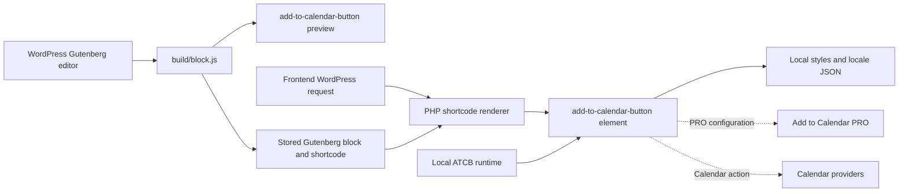

# Architecture

## Purpose

This repository contains the WordPress plugin for [Add to Calendar Button](https://add-to-calendar-button.com/). It exposes the upstream web component through:

- A WordPress shortcode rendered by PHP.
- A Gutenberg block that previews the web component and persists a shortcode.
- Optional Add to Calendar PRO configuration and dynamic WordPress data overrides.

The plugin packages the upstream Add to Calendar Button runtime locally. It does not depend on a CDN for button styles or translations.

This document describes the current architecture. Always update it and `AGENTS.md` when structural changes make either document inaccurate or incomplete, but never append dated updates, completed work, or historical notes. Git history and `readme.txt` are the appropriate places for history and changelog entries.

## System Context



## Runtime Boundaries

### WordPress Bootstrap

`add-to-calendar-button.php` is the plugin entry point. It owns:

- Plugin metadata and version constants.
- The shared public attribute allowlist.
- Inclusion of settings and plugin-link modules.
- Frontend and admin runtime script enqueueing.
- Shortcode validation, sanitation, and rendering.
- Gutenberg script registration and server-to-editor settings.

The main hooks are:

| Hook | Callback | Purpose |
| --- | --- | --- |
| `admin_enqueue_scripts` | `atcb_enqueue_script()` | Loads the ATCB runtime in wp-admin for editor previews. |
| `wp_enqueue_scripts` | `atcb_enqueue_script()` | Loads the ATCB runtime on the frontend. |
| `enqueue_block_assets` | `atcb_enqueue_script()` | Loads the ATCB runtime inside the iframe editor canvas. |
| `init` | `atcb_register_block()` | Registers and configures the Gutenberg block. |
| Shortcode `add-to-calendar-button` | `atcb_shortcode_func()` | Renders the web component. |

The ATCB runtime is currently enqueued globally rather than only when a block or shortcode is present. Repeated enqueue calls use one WordPress script handle and do not produce duplicate script tags.

### Shortcode Rendering

The shortcode renderer returns a custom element:

```html
<add-to-calendar-button ... style-source="LOCAL_VERSIONED_URL/styles/"></add-to-calendar-button>
```

`atcb_is_allowed_attribute()` treats case, hyphens, and underscores as equivalent only for allowlist comparison. Separator spelling is retained when PHP renders the attribute; WordPress normally lowercases shortcode attribute names before the callback. This permits official v3 kebab-case names and supported legacy aliases while rejecting unrelated element attributes.

`style-source` is deliberately not user-configurable. PHP always appends a plugin-controlled URL so dynamic CSS and locale requests remain local.

Shortcode values may contain nested shortcodes. Values are processed, stripped of HTML, bracket-normalized where needed, and escaped before output.

### PRO And Dynamic Overrides

Dynamic overrides are active only when a `prokey` is present. Prefixes select a WordPress data source:

| Prefix | Source |
| --- | --- |
| `mf-` | Current post metadata through `get_post_meta()`. |
| `acf-` | Advanced Custom Fields through `get_field()`. |
| `sc-` | Another WordPress shortcode through `do_shortcode()`. |

For meta and ACF fields, the special value `wp-title` resolves to the current post title. Datetime convenience fields are split into date and time attributes after format validation.

When at least one dynamic value is resolved, the renderer adds `prooverride` and `proxy="false"`; admin rendering also adds `debug`. Dynamic values depend on the current global post context. The ACF path assumes the ACF `get_field()` function exists.

### Gutenberg Block

`block.js` registers `add-to-calendar/button`. It contains the complete block schema, Inspector controls, free-form attribute parser, editor preview, and save implementation. There is no `block.json`, PHP `render_callback`, or separate React application.

The block registers with API version 3 in both PHP and JavaScript so it works in the iframe editor. WordPress 6.3, where Block API v3 was introduced, is the minimum supported WordPress version.

The block has two configuration modes:

- Free mode stores structured `name` and calendar `options`, with additional attributes in `content`.
- PRO mode stores a `prokey`, optional dynamic source settings, and additional `prooverrides`.

The editor preview wraps a real `<add-to-calendar-button>` in the standard `useBlockProps()` element required for Gutenberg selection and Inspector controls. The component receives `debug`, `blockInteraction`, parsed attributes, and the local `style-source`. Dynamic WordPress data is not resolved in the editor.

The block is not rendered directly on the frontend. Its `save()` method serializes `[add-to-calendar-button ...]`. WordPress executes that shortcode on each request, which preserves dynamic post metadata, ACF, nested-shortcode, and title behavior.

Changes to the block attribute schema, parser, or `save()` output can invalidate existing Gutenberg content. There is currently no deprecated block version or migration layer, so preserve existing serialization unless a migration is added deliberately.

### Settings And Plugin Links

`atcb-options.php` implements `ATCBSettingsPage` under WordPress Settings. The `atcb_global_settings` option currently stores only `atcb_pro_active`. This preference hides PRO advertising and selects the initial editor mode; it does not authenticate PRO usage.

`atcb-plugin-links.php` adds settings, documentation, configuration, and PRO links to the plugin list.

`atcb-options.css` and `rocket.webp` support the settings UI.

## Local ATCB Assets

The exact `add-to-calendar-button` npm package is the source of truth. `scripts/build-atcb-assets.mjs` validates the upstream package layout, cleans only `build/atcb/`, and creates:

```text
build/atcb/<ATCB_SCRIPT_VERSION>/
├── atcb.min.js
├── LICENSE.txt
├── locales/
│   └── *.json
└── styles/
    └── *.css
```

English and the default style are embedded in `atcb.min.js`. Other assets load on demand:

```text
style-source:  .../build/atcb/<version>/styles/
style request: .../build/atcb/<version>/styles/<style>.css
locale request:.../build/atcb/<version>/locales/<language>.json
```

The upstream runtime derives the locale directory by replacing the terminal `styles/` segment. It can also infer sibling asset directories from its own script URL for manually authored custom elements. `load-all-styles` prefetches all non-embedded style deltas for runtime style switching.

The versioned directory provides cache busting. The old tracked `lib/` copies and separate unstyled bundle are not part of this architecture.

## Build Architecture

The build uses Node.js, npm, webpack, Babel, and `@wordpress/dependency-extraction-webpack-plugin`.

```text
npm run build
├── scripts/build-atcb-assets.mjs
├── webpack --mode production
│   ├── build/block.js
│   └── build/block.asset.php
└── scripts/verify-build.mjs

npm start
├── scripts/build-atcb-assets.mjs
└── webpack --mode development --watch
```

The block imports WordPress modules such as `@wordpress/components`, but they are not bundled or installed directly. The dependency extraction plugin maps them to WordPress-provided `window.wp` globals and generates `build/block.asset.php` with the required script handles and content version.

The block uses `createElement`, not JSX. `.babelrc` therefore needs only `@babel/preset-env`.

`scripts/verify-build.mjs` verifies:

- Plugin version agreement across package metadata, PHP metadata/constants, and `readme.txt`.
- Exact agreement between the pinned ATCB package and `ATCB_SCRIPT_VERSION`.
- Presence and byte equality of the generated core, styles, locales, and vendor license.
- Absence of old `lib/*.js` release files.
- Inclusion of `build/` in the WordPress.org release payload.

Webpack does not clean all of `build/`; only the ATCB asset script cleans its dedicated subtree. Build output is ignored by Git and must be regenerated for every installation package.

## Source, Generated, And Distributed Files

| Category | Paths | Rules |
| --- | --- | --- |
| Runtime source | `*.php`, `block.js`, `atcb-options.css` | Edit directly. |
| Build configuration | `package.json`, `package-lock.json`, `.babelrc`, `webpack.config.js`, `scripts/` | Edit directly and verify with a clean npm install/build. |
| Generated output | `build/` | Never hand-edit or commit; generate with npm scripts. |
| Upstream dependencies | `node_modules/` | Never edit or commit. |
| WordPress UI translations | `languages/*.po`, `*.mo`, `*.pot` | Gettext catalogs for plugin/admin/editor strings. |
| ATCB runtime translations | `build/atcb/<version>/locales/*.json` | Generated browser-component translations from npm. |
| WordPress.org assets | `.wordpress-org/` | Listing images, screenshots, and Playground blueprint. |
| User-facing plugin docs | `readme.txt` | WordPress.org metadata, help, changelog, and stable tag. |
| Contributor docs | `README.md`, `AGENTS.md`, `.ai/Architecture.md` | Repository and agent guidance. |

`.gitignore` excludes `build/` and `node_modules/`. `.distignore` excludes repository-only material from WordPress.org but must not exclude `build/`.

## Versions And Release Invariants

The plugin release version must remain synchronized in:

- `package.json` `version`.
- Root package metadata in `package-lock.json`.
- The PHP plugin header `Version`.
- `ATCB_PLUGIN_VERSION`.
- `readme.txt` `Stable tag`.

The upstream runtime version must remain synchronized in:

- The exact `devDependencies.add-to-calendar-button` version.
- `package-lock.json`.
- `ATCB_SCRIPT_VERSION`.
- The generated `build/atcb/<version>/` directory.

Minor and major plugin releases require a changelog update in `readme.txt`. GitHub release tags use bare semantic versions such as `3.0.0` and must match `package.json`.

## Translation And Licensing Boundaries

WordPress gettext files and ATCB runtime locale JSON serve different systems and must not be merged:

- `languages/` translates plugin UI and editor labels through WordPress.
- Generated ATCB JSON translates the button rendered in the browser.

The plugin source is GPLv3 or later under root `LICENSE.txt`. The upstream ATCB runtime uses the Elastic License 2.0; its license must remain beside every generated runtime version.

## CI And Deployment

The dependency-security workflow runs on pull requests and pushes to `main`. It performs a lockfile install without lifecycle scripts, full and production-only npm audits, custom compromised-package checks, IOC scanning, and a production build.

Pushes to `main` independently build and deploy to the staging WordPress installation over FTPS.

Publishing a GitHub release validates the semantic version and main-branch target, performs `npm ci && npm run build`, and deploys through the WordPress.org deployment action. Generated `build/` assets are therefore included without being committed.

The Playground blueprint installs the published WordPress.org plugin, not the local worktree, so it is not a local integration test.

## Verification Boundaries

There is no automated PHP unit suite, WordPress integration environment, Gutenberg serialization test, or browser end-to-end suite. The reliable automated checks are the production build, build verifier, PHP syntax checks, npm audits, and custom dependency-security scripts.

Changes affecting shortcode sanitation, dynamic data, block persistence, PRO behavior, or runtime loading still require focused manual WordPress testing. Test both editor and frontend behavior, and include subdirectory or multisite URLs when changing asset URL construction.
